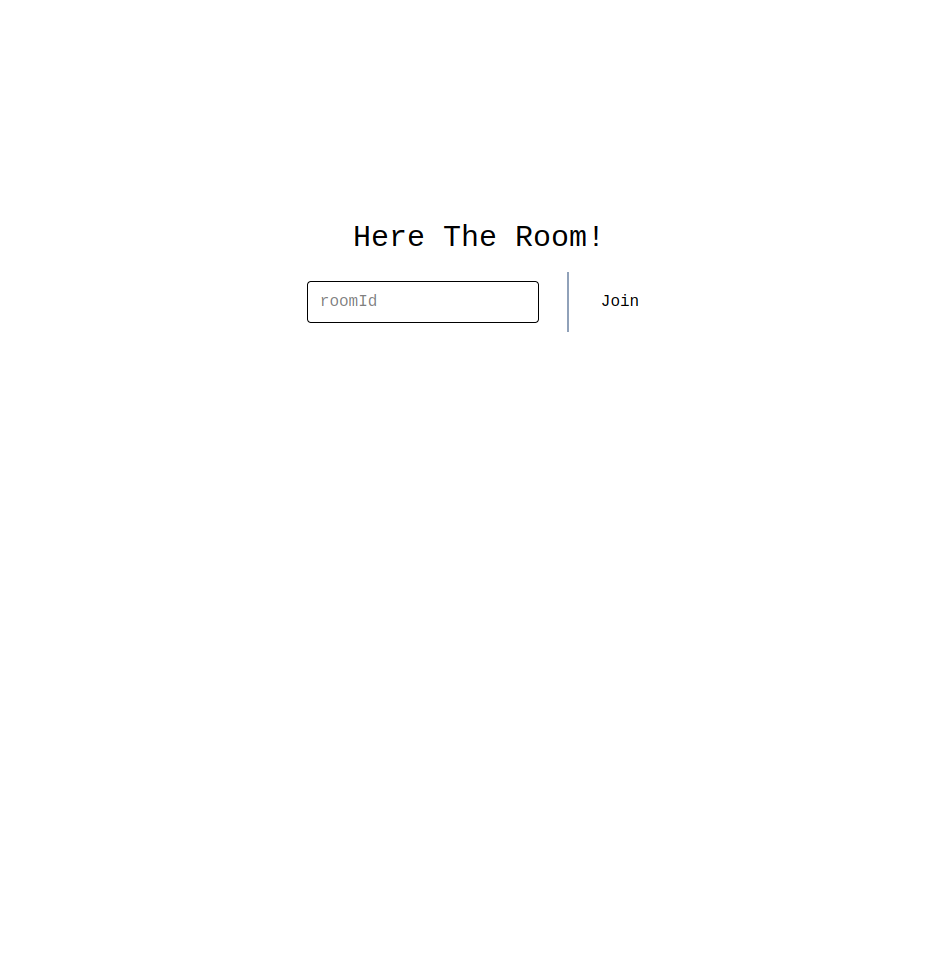
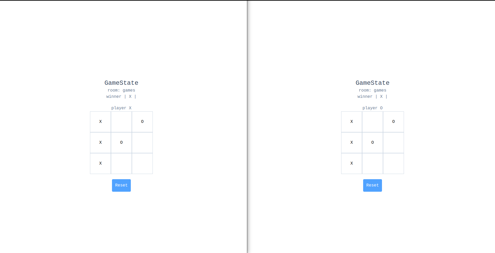

<h2 align="center">Introduction</h2>
A real-time multiplayer tic-tac-toe game that supports multiple concurrent games rooms with isolated instances for each match. Built with client-server architecture, clients responsible for UI only, all GameLogic is handled serverside with Websockets.


## Architecture Overview
### RoomLogic:

- __Creation and Joining__
    - players can create a new room or join an existing one
    - roomCreator is designated as __Player X__ and SecondJoiner as __Player X__
- __Multi-Room Support__
    - application allows multiple games to run concurrently
    - each room is limited to 2 players. If additional players attempt to join. They are redirected to join other available room.


## Installation & Setup

- Clone the repo:
    ```
    git clone https://github.com/amr0exe/tic-tac-toe.git && cd tic-tac-toe
    ```
- Install dependencies:
    ```
    pnpm install (on both client & working-backend)
    ```
- Running the app:
    ```
    pnpm run dev (on client)
    pnpm start   (on working-backend)
    ```

## Game Images

<div align="center">
    
    
</div>

## Future Enhancements

- adding a leaderboard
- implementing spectator-mode

